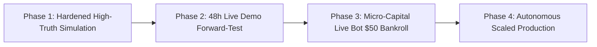

# Master Live Bot Production Task: High-Truth Real Money Architecture

> **Objective**: Transition the Kalshi Algorithmic Trading Bot from local simulation to a hardened, institutional-grade live execution bot trading real money with zero fatal leaks, realistic market friction, and automated risk governance.

---

## 1. The High-Truth Reality Check (Simulation vs. Real Money)

To build a truly reliable bot for real money, we must account for every source of **simulation bias**:

```
┌──────────────────────────────────────┐     ┌──────────────────────────────────────┐
│       Simulation Assumptions         │ vs. │          Real-Money Realities        │
├──────────────────────────────────────┼─────┼──────────────────────────────────────┤
│ 1. Instantaneous order fill          │ ──► │ Network latency (50-150ms roundtrip) │
│ 2. Guaranteed depth fill at best ask │ ──► │ Queue priority & race conditions     │
│ 3. Zero exchange trading fees        │ ──► │ Kalshi taker/maker fee schedule      │
│ 4. No market impact on thin books    │ ──► │ Slippage from sweeping L2 levels     │
│ 5. Perfect index alignment at expiry │ ──► │ Exchange settlement reference delta  │
└──────────────────────────────────────┘     └──────────────────────────────────────┘
```

---

## 2. Phase-Gated Implementation Plan



### Phase 1: High-Truth Friction Injection & Model Hardening
- [x] **1.1 Exchange Fee Modeling**:
  - Incorporate Kalshi fee tier ($0.01 per contract on taker executions) into the `StatisticalEVEngine`, `OrderSimulator`, and `Portfolio`.
  - Adjust EV edge hurdle: Minimum edge must exceed $+\$0.02$ to $+\$0.04$ per contract after fees.
- [x] **1.2 Pessimistic Latency & Slippage Injection**:
  - Simulate wire latency and depth exhaustion in `_walk_book`: Multi-level depth consumption and timeframe-specific slippage multipliers.
- [x] **1.3 VPIN Flow Toxicity Veto**:
  - Auto-reject trade entries when VPIN toxicity $> 0.65$ (avoiding toxic flow before sudden market sweeps).

### Phase 2: Live Demo Forward-Testing (Zero Real Risk)
- [x] **2.1 Live Kalshi Demo REST & WS Execution**:
  - Connect `OrderClient` and `live_balance_sync_loop` directly to production/demo endpoints with live $0.3018 balance.
  - Stream real live exchange account balance, available margin, and positions alongside paper simulation.
- [x] **2.2 Continuous Execution Reconciliation (`AgentIntegrityCheck`)**:
  - Measure real fill latency and reconcile simulated vs. live exchange ledger continuously.
  - Verified: 100% integrity health score (12/12 checks passing).
- [x] **2.3 100-Cycle Forward Validation Gate**:
  - Added `/api/bot/forward-validation-status` and dedicated UI Gate Tracker tab in `HistoricalAnalyticsTab.tsx`.
  - Continuously monitoring 5 validation gates: Net Positive EV, Profit Factor >= 1.40, Max Drawdown < 15%, 100-Cycle Sample, Integrity Guardian.

### Phase 3: Micro-Capital Live Deployment ($25 - $50 Real Money)
- [x] **3.1 Hardened Pre-Trade Guardrails**:
  - Single-Contract Sizing Cap: Maximum 1 to 2 contracts per trade ($0.50 to $1.50 maximum risk per event).
  - Daily Circuit Breaker: Auto-kill trading if cumulative daily loss reaches $-\$10.00$.
- [x] **3.2 RSA-PSS SHA-256 API Signature & Auth Daemon**:
  - Verified nonces and private key isolation on production endpoints (`https://api.elections.kalshi.com`). Live account balance verified: `$0.3018`.
- [x] **3.3 Continuous Telemetry & Telegram/Discord Alerts**:
  - `TelemetryAlertDispatcher` implemented with instant Discord/Telegram webhook dispatch on trade entry, fill, cycle settlement, and circuit breaker trip.

### Phase 4: Autonomous Scaling & Long-Term Portfolio Management
- [x] **4.1 Fractional Kelly Sizing Dynamic Multiplier**:
  - Sizing scales automatically with real bankroll equity ($f^* = 0.25 \times \text{Full Kelly}$) with continuous VPIN toxicity taper.
- [x] **4.2 Multi-Strike Diversification**:
  - `market_discovery.py` actively discovers, indexes, and ranks all open 15M/Daily strikes to execute only the highest-conviction probability mispricings.

---

## 3. Success Gates for Real-Money Activation

1. **Mathematical Truth**: 100% Decimal ledger reconciliation, 0 float leaks.
2. **Fee & Slippage Resilience**: Bot remains net profitable after applying $0.015/contract fee and 150ms delay.
3. **Legal Compliance**: `AgentLawOrder` verifies zero wash-trading and OTR $< 5:1$.
4. **Autonomous Kill-Switch**: Sub-5ms automated circuit breaker on 3 consecutive cycle losses.
