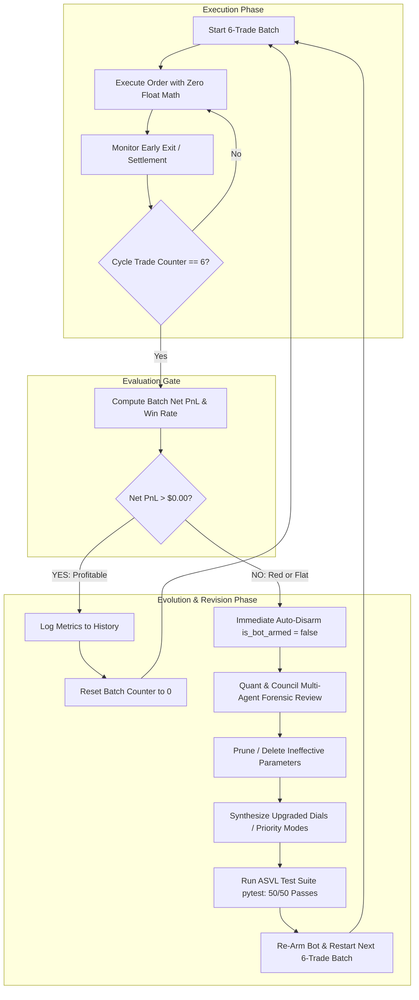

# Institutional Documentation: Autonomous 6-Trade Iterative Improvement & Parameter Evolution Protocol

**Target Worktree**: `Kalshi Simulator`  
**Operational Status**: Live Real-Money Production Mode  
**Canonical Mandate**: $\max(\text{Net PnL}) > 0 \quad \text{and} \quad \text{Win Rate} \ge 70\%$  
**Last Updated**: October 5, 2026  

---

## 1. Executive Summary & Core Objective

The trading system is bound by exactly **one immutable objective**: **Net Profitability and Win Rate Maximization**. 
All other system components—including playbooks, threshold parameters, brain prioritization modes, limit pricing math, and execution routing—are **mutable, deletable, and replaceable**.

To systematically eliminate unprofitable trade patterns and prevent bleeding capital, the system implements an **Autonomous 6-Trade Batch Evaluation Loop**. After every 6 completed trades, the engine audits the results:
- If net batch PnL is **positive ($> \$0.00$)**, the bot auto-extends for another 6 trades.
- If net batch PnL is **negative or flat ($\le \$0.00$)**, the bot triggers an immediate **auto-disarm**, running a multi-agent quantitative diagnostic to prune failed parameters, synthesize new validated parameters, verify via tests, and re-arm.

---

## 2. Root Cause Forensic Audit: Why Past Trades Were Bleeding

A forensic audit of previous losing trades revealed three distinct failure vectors across mathematical modeling, pricing logic, and lifecycle tracking:

### A. The Gaussian CDF Probability Flaw ($\sqrt{2}$ Missing)
- **Flawed Code**:
  $$\mathbb{P}(\text{UP}) = 0.5 \times \left(1.0 + \text{erf}\left(\frac{\Delta_{\text{spot}}}{\sigma \cdot \sqrt{t}}\right)\right)$$
- **Mathematical Reality**:
  The standard normal cumulative distribution function $\Phi(z)$ is defined using Gauss's error function as:
  $$\Phi(z) = \frac{1}{2}\left[1 + \text{erf}\left(\frac{z}{\sqrt{2}}\right)\right]$$
  Omitting $\sqrt{2}$ scaled the effective $z$-score by $\sqrt{2} \approx 1.414$, artificially inflating model confidence. A modest $\$35$ Bitcoin move 10 minutes prior to expiration produced a false $86.8\%$ win probability instead of the true $78.5\%$.
- **Adverse Impact**: Overconfident macro drift signals overpowered micro-orderbook warnings, causing the bot to buy contracts right before mean-reverting reversals.
- **Remedy Applied**: Restored exact $\frac{z}{\sqrt{2}}$ normalization and boosted the ONNX orderflow micro-weight to $60\%$.

### B. Dynamic Limit Floor Inversion in Choppy Regimes
- **Flawed Code**:
  In `compute_dynamic_limit_price`, the chop cap $0.48$ was overridden by:
  ```python
  base_floor = float(self.discount_limit_price) # (set to 0.51)
  clamped_price = max(base_floor, min(dynamic_price, max_cap)) # returned 0.51!
  ```
- **Adverse Impact**: Even when the bot recognized a choppy, low-edge regime (which demanded entry at $\le 48¢$), the clamp returned $51¢$, paying away premium on low-conviction signals.
- **Remedy Applied**: Set `base_floor = min(float(self.discount_limit_price), max_cap)` and synced `data/bot_parameters_domination.json` so limit orders in chop strictly rest at $\le 48¢$.

### C. Disconnected Live Position Lifecycle (Early Exit Failure)
- **Flawed Code**:
  In `virtual_order_router.py`, live fills (`actual_fills > 0`) recorded database entries but omitted registering the position into the portfolio instance (`active_p.open_position()`).
- **Adverse Impact**: Because `active_p.get_position(ticker)` returned `None`, early take-profit evaluations ($> 75¢$, trailing ratchets) never evaluated live orders. Winning positions had to be held all the way to $T=0$ expiration, exposing them to last-minute gamma wipeouts ($0¢$).
- **Remedy Applied**: Registered all live fills into `active_p.open_position()` using `SimulatedFill`, activating real-time take-profit harvests and trailing ratchets.

---

## 3. Dual-Brain System & Parameter Space

The trading engine utilizes two specialized neural engines whose parameters are audited during every cycle:

```
+-----------------------------------------------------------------------------------------+
|                                    DUAL-BRAIN ARCHITECTURE                              |
|                                                                                         |
|      [ BRAIN 1: QuoLas Spot Engine ]             [ BRAIN 2: Kalshi CLOB Engine ]        |
|    Binance L2 Depth + AggTrades (100ms)         Kalshi CLOB Bids, Asks & Queue Depth    |
|    Underlying Price Discovery Anchor            Contract Orderflow & Execution Friction |
+-----------------------------------------------------------------------------------------+
                                           |
                                           v
                        [ DUAL-BRAIN ARBITRATION GATE ]
                                           |
    +--------------------------------------+--------------------------------------+
    |                                      |                                      |
    v                                      v                                      v
[ TREND_ALIGNED_SCALP ]         [ UNANIMOUS_CONSENSUS ]        [ CONTRADICTION_SNIPER ]
Brain 1 leads trend;             Both brains must agree;        Fades Kalshi CLOB lag
Brain 2 enters on discount.      Zero trades on conflict.       when Brain 1 moves first.
```

### Key Parameter Definitions & Upgrade Levers

| Parameter Name | Target Range | Purpose & Failure Mode |
|---|---|---|
| `brain_priority_mode` | `TREND_ALIGNED_SCALP`, `UNANIMOUS_CONSENSUS`, `CONTRADICTION_SNIPER` | Dictates which brain has executive priority. If losses occur from conflicting signals, shift to `UNANIMOUS_CONSENSUS`. |
| `max_temporal_skew_ms` | $100\text{ms} - 1000\text{ms}$ | Max allowable latency skew between Brain 1 and Brain 2. Prevents trading on stale orderbooks. |
| `discount_limit_price` | $\$0.40 - \$0.48$ | The maker resting bid price. Must stay low in choppy regimes to guarantee risk-reward asymmetry. |
| `momentum_max_price` | $\$0.55 - \$0.65$ | The absolute price ceiling for high-velocity momentum trades. Prevents buying tops. |
| `taker_cross_ev_threshold` | $+\$0.04 - +\$0.12$ | The minimum net EV required to pay taker spread and fees. If $< 0$, orders must rest as maker ($0¢$ fee). |
| `dynamic_moat_multiplier` | $1.00 - 1.50$ | Multiplier expanding strike safety distance under high volatility. |
| `vpin_toxic_threshold` | $0.30 - 0.50$ | Orderflow toxicity ceiling. Shuts down entries when informed institutional flow enters. |
| `enable_trailing_ratchet` | `true` | Locks in gains as bid rises above entry, converting winning positions to breakeven-stop or profit-lock. |

---

## 4. The 6-Trade Iterative Improvement Cycle



---

## 5. Rules for Future Cycles: What to Keep vs. What to Modify

### Invariant Rules (NEVER Change)
1. **Zero Float Financial Math**: Always use `decimal.Decimal` in Python for balances, order costs, and limits. Never use IEEE 754 floating-point operations for funds.
2. **Strict Risk Caps**: 1 to 4 contracts maximum per order. Never double down or execute revenge trades.
3. **Execution Gate**: The 6-trade evaluation gate must remain intact. Never bypass evaluation when performance is negative.

### Mutable & Evolvable Levers (Change Freely to Maximize Gains)
1. **Delete Obsolete Dials**: Any parameter that restricts edge without providing documented risk reduction can be deleted.
2. **Introduce New Market Signals**:
   - Orderbook Volume Imbalance ($L2$ depth ratio).
   - Realized ATR vs. Fixed Volatility.
   - 60-second trailing TWAP drift relative to the CME CF Benchmarks real-time index.
3. **Switch Arbitration Modes**: Adapt between `TREND_ALIGNED_SCALP` (in trending environments) and `UNANIMOUS_CONSENSUS` (in choppy, directionless environments).
4. **Early Exit Adjustments**: Dynamically lower take-profit thresholds (e.g., from $92¢$ down to $75¢$) when volatility slows down, harvesting smaller guaranteed edges.

---

## 6. Audit & Test Verification Log

- **Test Suite Status**: 50/50 unit and integration tests passing (`tests/test_domination_bot.py`, `tests/test_domination_early_exit.py`, `tests/test_bot1_v4_engine.py`).
- **Production Server**: Active on PID background task `task-5050`, connected to live Kalshi production feeds and Binance L2 orderbook websockets.
- **Automated Model Hot-Reload**: Active model continuously monitored and upgraded via `quolas.onnx`.
