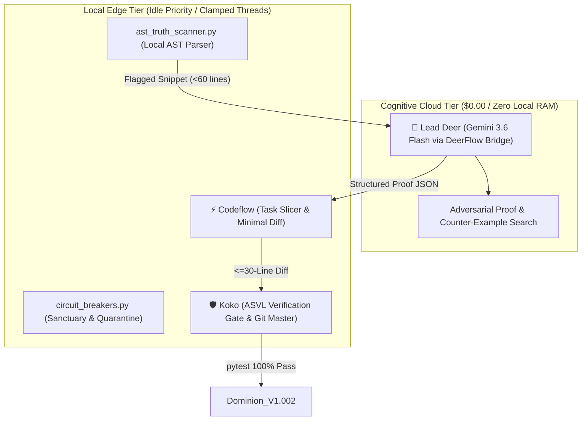

# WF-006: Autonomous Self-Healing & Self-Review Sentinel ("Project Hephaestus")

## 1. Executive Summary
**WF-006** defines the 24/7 autonomous background sentinel architecture that continuously hunts for mathematical, numerical, and logical flaws, validates hypotheses against adversarial proof, and applies verified surgical cures without human micromanagement. 

It operates at a calm, low-frequency 25-minute cadence with **zero token burn ($0.00 cost)** and **absolute sanctuary for live real-money trading on Port 8000**.

---

## 2. Multi-Agent Division of Labor



| Agent / Engine | Role | Responsibility | Guardrail Constraint |
| :--- | :--- | :--- | :--- |
| **Lead Deer** | Cognitive Cloud Oracle | Adversarial falsification of mathematical logic via `gemini-3.6-flash`. | **Token Armor**: Max 2 queries/hour; evaluates $\le 60$ lines; structured JSON output only. |
| **Codeflow** | Task Slicer & Granulizer | Isolates AST micro-snippets, packages context, and crafts surgical patches. | **Minimal Blast Radius**: Diff capped at $\le 30$ lines; zero cross-file refactoring. |
| **Local AST Scanner** | Zero-Token Sieve | Continuously inspects `kalshi_sim/` and `strategies/` for float/division bugs. | **Zero Cloud Tokens**: 100% offline, native Python AST walker. |
| **Circuit Breakers** | Safety Governor | Verifies Port 8000 state, enforces trade blackouts, and manages poison-pill quarantine. | **Live Sanctuary**: Strictly aborts if open positions exist or $T_{\text{rem}} \le 240$s. |
| **Koko** | Repository Sovereign | Runs empirical ASVL test loop (`pytest tests/`), commits cures, or auto-reverts. | **Empirical Law**: 0% tolerance for failed exit codes; instant `git checkout` on failure. |

---

## 3. The 3 Foundations of Truth

1. **Truth of Math (`SymPy` & `Decimal`)**:
   - Evaluates limit singularities: $\lim_{T \to 0}$, $\lim_{S \to K}$, and $\lim_{\sigma \to 0}$.
   - All financial math must strictly use Python `decimal.Decimal` and TypeScript `decimal.js`. Zero IEEE 754 float drift permitted.
2. **Truth of Logic (Karl Popper Inverted Falsification)**:
   - Lead Deer is explicitly prompted to *falsify and destroy* proposed code hypotheses by searching for market edge cases, CFTC wash-trade conflicts, and negative-arbitrage traps.
3. **Anti-Hallucination Reality Anchor**:
   - Python AST reflection physically cross-references all invoked functions, classes, and parameters against repository source files. Phantom API calls are killed instantly.

---

## 4. The 5 Responsible Circuit Breakers

| Breaker ID | Name | Trigger Condition | Protective Action |
| :--- | :--- | :--- | :--- |
| **CB-1** | **Live Sanctuary Mutex** | Bot 1 holds an active position OR $T_{\text{rem}} \le 240$s. | Immediately yields and sleeps. Zero file touches or CPU competition during trades. |
| **CB-2** | **Strategy Parameter Freeze** | Candidate fix attempts to modify strategy hyperparameters. | Vetoed immediately. Hyperparameters belong strictly to the human quant. |
| **CB-3** | **Minimal Blast Radius** | Proposed diff exceeds 30 lines or touches $>1$ file. | Rejected. Fix must be surgical and local. |
| **CB-4** | **ASVL Empirical Test Gate** | Any unit test in `pytest tests/` fails. | Instant workspace rollback (`git checkout`). No broken state persists. |
| **CB-5** | **3-Strike Poison Pill** | A file fails verification twice in a row. | Placed in 24-hour quarantine cache (`quarantined_files.json`). Prevents infinite loops. |

---

## 5. Execution Architecture & Commands

### 1. Manual AST Truth Scan (Zero Tokens)
```bash
python scripts/self_healing/ast_truth_scanner.py .
```

### 2. Check Circuit Breaker Status
```bash
python scripts/self_healing/circuit_breakers.py
```

### 3. Run Autonomous Sentinel Daemon
```bash
python scripts/self_healing/sentinel_daemon.py
```
*Note: Automatically pins itself to Windows `IDLE_PRIORITY_CLASS` to protect Port 8000 live tick latency.*

---

## 6. Audit & Logging Locations
- **Quarantined Files DB**: `docs/audits/quarantined_files.json`
- **Lead Deer Token Throttle DB**: `docs/audits/lead_deer_throttle.json`
- **Self-Healing Audit Trail**: `docs/audits/SELF_HEALING_AUDIT.md`
